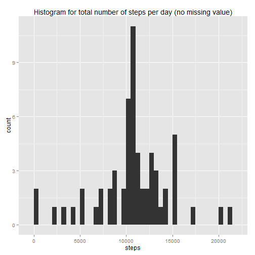

##Loading and preprocessing data
The first step is to load data from csv file with the opition of ```stringsAsFactor = false``` to prevent date string to load as factor.


```r
activity <- read.csv("./activity.csv", na.strings = "NA", stringsAsFactors = FALSE)
```

Check to see if any preprocessing is needed using ```summary()``` and ```str()```


```r
summary(activity)
```

```
##      steps            date              interval     
##  Min.   :  0.00   Length:17568       Min.   :   0.0  
##  1st Qu.:  0.00   Class :character   1st Qu.: 588.8  
##  Median :  0.00   Mode  :character   Median :1177.5  
##  Mean   : 37.38                      Mean   :1177.5  
##  3rd Qu.: 12.00                      3rd Qu.:1766.2  
##  Max.   :806.00                      Max.   :2355.0  
##  NA's   :2304
```

```r
str(activity)
```

```
## 'data.frame':	17568 obs. of  3 variables:
##  $ steps   : int  NA NA NA NA NA NA NA NA NA NA ...
##  $ date    : chr  "2012-10-01" "2012-10-01" "2012-10-01" "2012-10-01" ...
##  $ interval: int  0 5 10 15 20 25 30 35 40 45 ...
```

The data has some ```NA``` in the steps column which is expected per instruction of the assignment. The data is in tidy format so I did not perform further preprocessing.


Loading ```dplyr``` package to prepare for data processing.

```r
library(dplyr)
```

##What is mean total number of steps taken per day?

1. Make a histogram of the total number of steps taken each day

- Aggregate data to calculate the sum by date column

```r
by_date <- activity %>% group_by(date)
total_steps <- by_date %>% summarise(sum(steps, na.rm = TRUE))
names(total_steps) <- c("date", "steps")
```

- Make histogram plot
Use ggplot2 to plot with binwidth = 500. 

```r
library(ggplot2)
```

```r
ggplot(total_steps, aes(x=steps)) + geom_histogram(binwidth = 500) + labs(title = "Histogram for total number of steps per day")
```

 

2. Calculate and report the mean and median total number of steps taken per day

```r
mean(total_steps$steps)
```

```
## [1] 9354.23
```

```r
median(total_steps$steps)
```

```
## [1] 10395
```

##What is the average daily activity pattern?

1.Make a time series plot (i.e. ```type = "l"```) of the 5-minute interval (x-axis) and the average number of steps taken, averaged across all days (y-axis)

- Aggregate data to calculate mean of steps by interval

```r
by_interval <- activity %>% group_by(interval)
mean_steps <- by_interval %>% summarise(mean(steps, na.rm = TRUE))
names(mean_steps) <- c("interval", "steps")
```

- Make the time series plot

```r
with(mean_steps, plot(interval, steps, type = 'l', xlab = "Interval", ylab = "Steps", main = "Average Daily Activity Pattern "))
```

 

2. Which 5-minute interval, on average across all the days in the dataset, contains the maximum number of steps?
The interval which has maximum number of steps is interval 835.

```r
mean_steps[which.max(mean_steps$steps),]
```

```
## Source: local data frame [1 x 2]
## 
##   interval    steps
## 1      835 206.1698
```

##Imputing missing values

1. Calculate and report the total number of missing values in the dataset (i.e. the total number of rows with ```NA```s)

Use ```sum()``` and ```is.na()``` to calculate the number of missing values in the dataset. From the output of ```summary()```, the missing values are in ```steps``` column. 


```r
summary(activity)
```

```
##      steps            date              interval     
##  Min.   :  0.00   Length:17568       Min.   :   0.0  
##  1st Qu.:  0.00   Class :character   1st Qu.: 588.8  
##  Median :  0.00   Mode  :character   Median :1177.5  
##  Mean   : 37.38                      Mean   :1177.5  
##  3rd Qu.: 12.00                      3rd Qu.:1766.2  
##  Max.   :806.00                      Max.   :2355.0  
##  NA's   :2304
```

```r
sum(is.na(activity$steps))
```

```
## [1] 2304
```

2. Devise a strategy for filling in all of the missing values in the dataset. The strategy does not need to be sophisticated. For example, you could use the mean/median for that day, or the mean for that 5-minute interval, etc.

- The mean of the same 5-minute interval as the missing value is used to fill in the missing values in the dataset.

- The code to identify value to use as missing values is as following:

```r
# Identify the row in dataset with missing value
na_list <- which(is.na(activity$steps))

# for each missing value, get the mean of the interval previously calculated, the result is in list
impute_func <- function (idx) {
  mean_steps[mean_steps$interval == activity$interval[idx], 2][1]
}
new_list <- lapply(seq_along(na_list), impute_func)

# Flatten the list to be used in the next step
new_steps <- unlist(new_list)
```

3. Create a new dataset that is equal to the original dataset but with the missing data filled in

```activity2``` dataset will contain the data with missing value filled in.


```r
activity2 <- activity
activity2$steps <- replace(activity$steps, na_list, new_steps)
summary(activity2)
```

```
##      steps            date              interval     
##  Min.   :  0.00   Length:17568       Min.   :   0.0  
##  1st Qu.:  0.00   Class :character   1st Qu.: 588.8  
##  Median :  0.00   Mode  :character   Median :1177.5  
##  Mean   : 37.38                      Mean   :1177.5  
##  3rd Qu.: 27.00                      3rd Qu.:1766.2  
##  Max.   :806.00                      Max.   :2355.0
```

4. Make a histogram of the total number of steps taken each day and Calculate and report the mean and median total number of steps taken per day. Do these values differ from the estimates from the first part of the assignment? What is the impact of imputing missing data on the estimates of the total daily number of steps?

- Aggregate the date for the ```activity2``` dataset

```r
by_date2 <- activity2 %>% group_by(date)
total_steps2 <- by_date2 %>% summarise(sum(steps, na.rm = TRUE))
names(total_steps2) <- c("date", "steps")
```

- Make the histogram plot

```r
ggplot(total_steps2, aes(x=steps)) + geom_histogram(binwidth = 500) + labs(title = "Histogram for total number of steps per day (no missing value)")
```

 

- Calculate the mean and median 

```r
mean(total_steps2$steps)
```

```
## [1] 10766.19
```

```r
median(total_steps2$steps)
```

```
## [1] 10766.19
```

The value of mean and median for steps per day has changed from the first part. Upon further examination of ```NA```s value in the original dataset, I found that the missing values can be found on 8 days (i.e. for these days, there is no data at all for any interval)


```r
unique(activity[is.na(activity$step),2])
```

```
## [1] "2012-10-01" "2012-10-08" "2012-11-01" "2012-11-04" "2012-11-09"
## [6] "2012-11-10" "2012-11-14" "2012-11-30"
```

As I chose to use average number of steps of the missing interval for missing values, the total steps of these 8 days then became the total of average steps per interval which is 


```r
sum(mean_steps$steps)
```

```
## [1] 10766.19
```

And this changes the mean and median values of ```activity2``` dataset.

##Are there differences in activity patterns between weekdays and weekends?

1. Create a new factor variable in the dataset with two levels - "weekday" and "weekend" indicating whether a given date is a weekday or weekend day.


```r
daytype <- function (date) {
 ifelse(weekdays(as.Date(date, "%Y-%m-%d")) %in% c("Sunday", "Saturday"), "weekend", "weekday") 
}
activity3 <- mutate(activity2, type = factor(daytype(date)))
```

2. Make a panel plot containing a time series plot (i.e. ```type = "l"```) of the 5-minute interval (x-axis) and the average number of steps taken, averaged across all weekday days or weekend days (y-axis)


```r
by_daytype <- activity3 %>% group_by(type, interval)
mean_steps_by_type <- by_daytype %>% summarise(mean(steps, na.rm = TRUE))
names(mean_steps_by_type) <- c("type", "interval", "steps")
library(lattice)
xyplot(steps ~ interval | type, data = mean_steps_by_type, type="l", layout = c(1,2), xlab = "Internval", ylab = "Number of steps")
```

 

